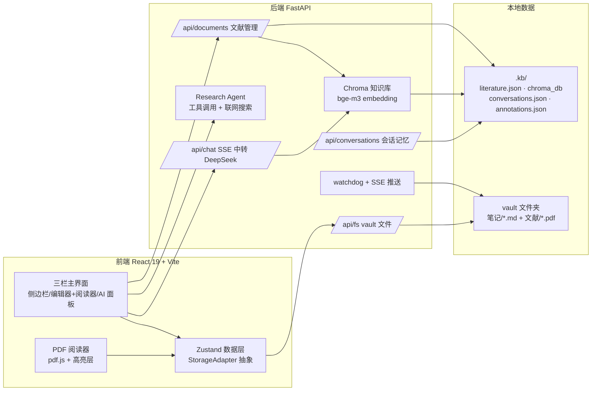

# 知微 · AI 科研工作台（AI Research Workbench）

个人学术文献工作台：**文献管理 → PDF 阅读 → 笔记+引用 → AI 问答 → 论文写作导出** 一条链路。
本地优先：所有数据以普通文件存放在你自选的 vault 文件夹中，不依赖云服务。

> 面向计算机专业研究生的科研提效工具——导入论文、高亮批注、划词翻译、AI 问答与研究任务、
> 笔记引用、按格式导出参考文献，全流程本地闭环。

## 功能特性

| 模块 | 能力 |
|---|---|
| 📚 文献管理 | PDF 导入（自动补全 DOI/arXiv 元数据）、集合分组、阅读状态与进度、元数据编辑 |
| 📖 PDF 阅读 | 划词复制/转笔记引用、**高亮批注**（点击高亮可编辑批注，持久化落盘）、**划词翻译**（内联译文）、页码进度自动恢复 |
| 📝 笔记 | Markdown + frontmatter、集合管理、Tiptap 编辑器、引用徽章内联插入、反向引用列表 |
| 🤖 AI 助手 | 全局/单篇 RAG 问答、总结/润色/续写任务、**对话记忆**（多会话 + 历史注入）、研究任务（Agent 多步执行 + 联网搜索 + 过程展示） |
| 📄 导出 | GB/T 7714 / APA / IEEE 的 docx 参考文献、BibTeX（支持按笔记集合过滤） |
| 🛡 本地优先 | vault 普通文件夹即数据源（.md 笔记可被 Obsidian/VS Code 打开）；watchdog 实时感知外部修改 |

## 架构总览



运行形态：开发期浏览器 + 本地后端；发布期 Tauri 2 桌面壳（内嵌前端 + 拉起后端进程）。

## 快速开始（开发模式）

要求：Node.js ≥ 20、Python ≥ 3.12。

```bash
# 1. 启动后端（首次运行会自动创建 vault 与索引）
cd backend
python -m venv .venv
.venv/Scripts/activate            # Windows；macOS/Linux: source .venv/bin/activate
pip install -r requirements.txt
cp .env.example .env              # 填写 DEEPSEEK_API_KEY（可选 SILICONFLOW_API_KEY）
python -m uvicorn app.main:app --port 3001

# 2. 启动前端（另开终端）
cd frontend
npm install
npm run dev                       # http://localhost:5173
```

打开浏览器访问 http://localhost:5173 —— 首次启动会进入**配置向导**（选择 vault 目录 + API key + 连通性测试），
无需手改 .env。

> 桌面版（Tauri 打包）正在开发中，见 [Roadmap](#roadmap)。

## 技术栈

- **前端**：React 19 / Vite / TypeScript / Tailwind CSS 4 / shadcn/ui / Zustand 5 / Tiptap 3 / pdf.js
- **后端**：FastAPI / openai SDK（DeepSeek 中转，SSE 流式）/ LangChain（embedding 与向量库侧）/ ChromaDB / watchdog
- **存储**：普通文件（Markdown + YAML frontmatter）+ `.kb/` 元数据目录（原子写）

## 目录结构

```text
├─ frontend/            # React 前端（src/pages、src/components/Reader 等）
├─ backend/             # FastAPI 后端（app/routers、app/agent 等）
├─ docs/                # 模块说明、面试问答、架构决策（ADR）
└─ 科研工作台需求文档.md  # 完整 PRD 与 WBS 排期
```

## 测试与构建

```bash
# 后端测试（151 个：持久层/路由/Agent/缓存/自愈/日志）
cd backend && .venv/Scripts/python -m pytest

# 前端类型检查 + 构建
cd frontend && npm run build
```

GitHub Actions 会在每次 push / PR 自动运行以上检查（见 `.github/workflows/ci.yml`）。

## Roadmap

- [x] M1：文献管理 / PDF 阅读 / 引用 / AI 问答 / 导出（B1-B8 + F1-F7）
- [x] M2 功能线：高亮批注 / 划词翻译 / 阅读进度 / 集合导出 / watchdog SSE
- [x] M2 产品化（部分）：对话记忆 / 本地缓存 / 启动向导 / 元数据编辑 / 索引自愈 / 日志
- [ ] M2 产品化（剩余）：Tauri 桌面壳 + Windows 安装包 / 开源发布

## 许可证

[MIT](./LICENSE)

---

截图与更多说明见 `docs/`（模块说明、面试问答、ADR 决策记录）。
