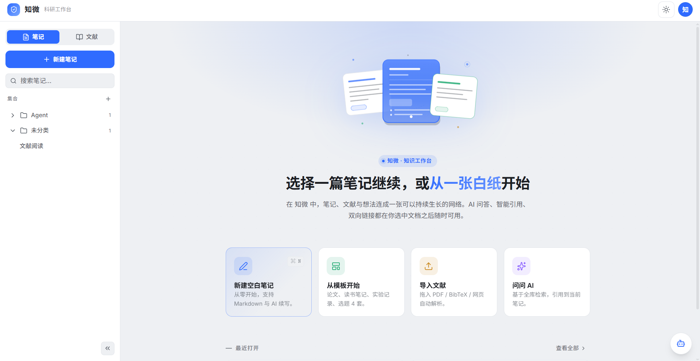
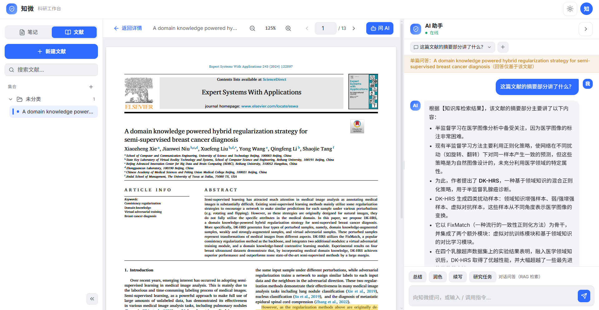
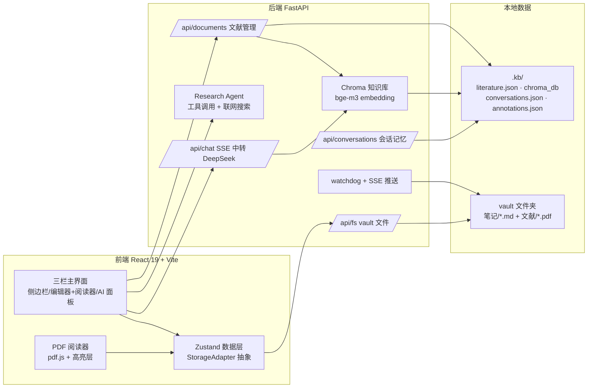

# 知微 · AI 科研工作台（AI Research Workbench）

个人学术文献工作台：**文献管理 → PDF 阅读 → 笔记+引用 → AI 问答 → 论文写作导出** 一条链路。
本地优先：所有数据以普通文件存放在你自选的 vault 文件夹中，不依赖云服务。

## 功能特性

| 模块 | 能力 |
|---|---|
| 📚 文献管理 | PDF 导入（自动补全 DOI/arXiv 元数据）、集合分组、阅读状态与进度、元数据编辑 |
| 📖 PDF 阅读 | 划词复制/转笔记引用、**高亮批注**（点击高亮可编辑批注，持久化落盘）、**划词翻译**（内联译文）、页码进度自动恢复 |
| 📝 笔记 | Markdown + frontmatter、集合管理、Tiptap 编辑器、引用徽章内联插入、反向引用列表 |
| 🤖 AI 助手 | 全局/单篇 RAG 问答、总结/润色/续写任务、**对话记忆**（多会话 + 历史注入）、研究任务（Agent 多步执行 + 联网搜索 + 过程展示） |
| 📄 导出 | GB/T 7714 / APA / IEEE 的 docx 参考文献、BibTeX（支持按笔记集合过滤） |
| 🛡 本地优先 | vault 普通文件夹即数据源（.md 笔记可被 Obsidian/VS Code 打开）；watchdog 实时感知外部修改；索引损坏自动重建；滚动日志 |
| 🖥 桌面版 | Tauri 2 壳 + PyInstaller 后端，Windows NSIS 安装包，动态端口、退出联动 |

## 界面预览






## 架构总览



运行形态：

- **开发期**：浏览器（Vite dev）+ 本地后端（uvicorn），前端经 `/api/fs/*` 读写 vault
- **发布期**：Tauri 2 桌面壳（WebView 加载前端产物）自动拉起后端进程，关窗联动退出；后端由 PyInstaller 打包（onedir）

## 快速开始

要求：Node.js ≥ 20、Python ≥ 3.12、Rust（仅桌面版构建需要）。

### 开发模式

```bash
# 1. 启动后端（首次运行会自动创建 vault 与索引）
cd backend
python -m venv .venv
.venv/Scripts/activate            # Windows；macOS/Linux: source .venv/bin/activate
pip install -r requirements.txt
cp .env.example .env              # 填写 DEEPSEEK_API_KEY（可选 SILICONFLOW_API_KEY）
python -m uvicorn app.main:app --port 3001

# 2. 启动前端（另开终端）
cd frontend
npm install
npm run dev                       # http://localhost:5173
```

打开浏览器访问 http://localhost:5173 —— 首次启动会进入**配置向导**（选择 vault 目录 + API key + 连通性测试），无需手改 .env。

### 桌面版（Windows 安装包）

```bash
# 1. 打包后端（PyInstaller onedir → backend/dist/backend-server/）
cd backend && .venv/Scripts/pyinstaller packaging/backend.spec --noconfirm

# 2. 构建 Tauri 壳 + NSIS 安装包
cd frontend && npm run tauri build
# 产物：src-tauri/target/release/bundle/nsis/*.exe
```

安装后首次启动进入向导：选择 vault 目录（系统目录选择器）+ 配置 DeepSeek / SiliconFlow Key。

> 配置说明：DeepSeek Key 用于对话/翻译/总结；SiliconFlow Key 用于向量索引与检索（bge-m3 embedding）。
> 未配置 SiliconFlow 时文献无法建立向量索引，问答无检索内容。

## 技术栈

- **前端**：React 19 / Vite / TypeScript / Tailwind CSS 4 / shadcn/ui / Zustand 5 / Tiptap 3 / pdf.js / Tauri 2
- **后端**：FastAPI / openai SDK（DeepSeek 中转，SSE 流式）/ LangChain（embedding 与向量库侧）/ ChromaDB / watchdog / PyInstaller
- **存储**：普通文件（Markdown + YAML frontmatter）+ `.kb/` 元数据目录（原子写，损坏可删重建）

## 目录结构

```text
├─ frontend/            # React 前端（src/pages、src/components/Reader 等）
├─ backend/             # FastAPI 后端（app/routers、app/agent、packaging 打包脚本等）
├─ src-tauri/           # Tauri 2 壳（端口探测、后端进程管理、退出联动）
├─ docs/                # 技术文档（接口说明、架构决策 ADR、验收清单）
└─ .github/workflows/   # CI（pytest + 前端构建）与 Release（Windows 安装包）
```

## 测试与构建

```bash
# 后端测试（150+：持久层/路由/Agent/缓存/自愈/日志）
cd backend && .venv/Scripts/python -m pytest

# 前端类型检查 + 构建
cd frontend && npm run build

# 桌面版打包（见上节）
```

GitHub Actions 会在每次 push / PR 自动运行检查（见 `.github/workflows/ci.yml`）；打 `v*` 标签触发 Windows 安装包构建与 Release 草稿（见 `.github/workflows/release.yml`）。

## Roadmap

- [x] M1：文献管理 / PDF 阅读 / 引用 / AI 问答 / 导出
- [x] M2 功能线：高亮批注 / 划词翻译 / 阅读进度 / 集合导出 / watchdog SSE
- [x] M2 产品化：对话记忆 / 本地缓存 / 启动向导 / 元数据编辑 / 索引自愈 / 日志 / 开源配套
- [x] M2 发布：Tauri 2 桌面壳 + 后端 PyInstaller 打包 + Windows NSIS 安装包
- [ ] M3（规划中）：多文献对比/综述、BM25+向量融合检索、笔记导出、全文搜索增强

## 许可证

[MIT](./LICENSE)
